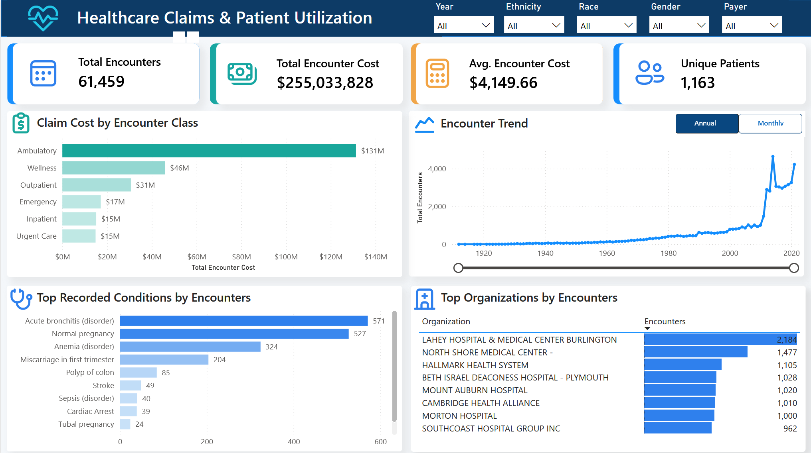
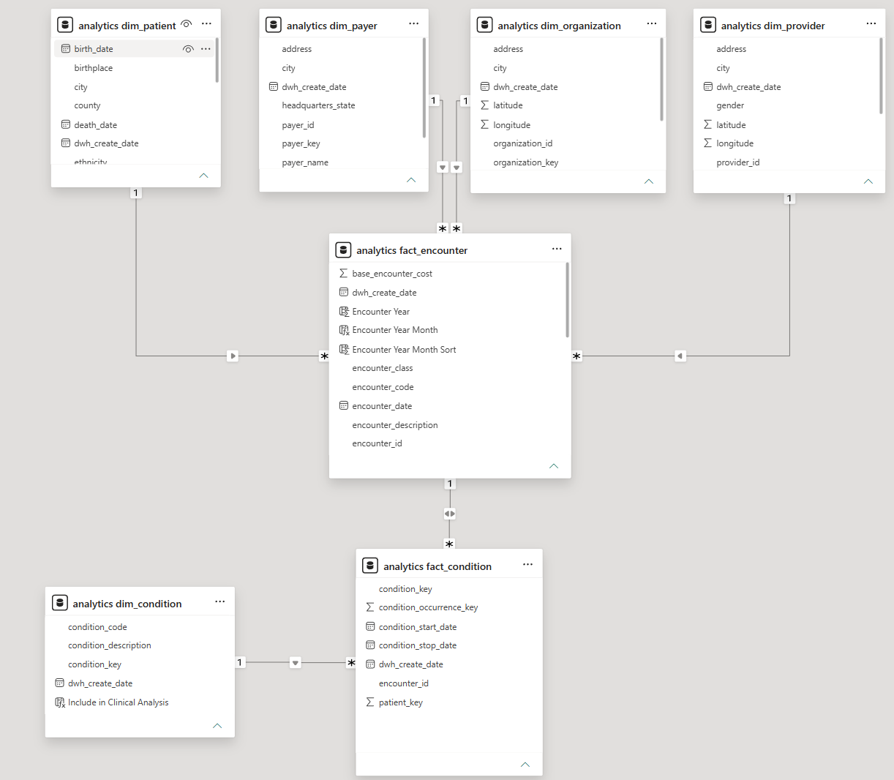

# Healthcare Claims & Patient Utilization Analytics

An end-to-end healthcare analytics portfolio project built with **SQL Server** and **Power BI**. The project loads synthetic Synthea CSV data into a layered SQL warehouse, cleans and standardizes source records, creates a dimensional analytics model, and presents utilization and claim-cost findings through an interactive dashboard.

> **Data notice:** This project uses synthetic healthcare data generated by Synthea. It contains no real patients or protected health information.

## Project Objective

The intended stakeholder is a healthcare analytics team seeking to understand:

- Which encounter classes account for the most claim cost?
- How has patient utilization changed over time?
- Which recorded clinical conditions appear most frequently?
- Which organizations handle the highest encounter volume?
- How do results change across payer and patient groups?

## Solution Overview

The solution follows an ELT architecture:

1. Load the Synthea CSV extracts into the `raw_data` schema.
2. Clean, standardize, and type the selected analytical datasets in `staging`.
3. Build dimensions and fact tables in the `analytics` schema.
4. Import the dimensional model into Power BI.
5. Create DAX measures, interactive filters, and an annual/monthly trend selector.

### Data layers

| Layer | Purpose |
|---|---|
| `raw_data` | Source-aligned tables loaded from the CSV files with minimal transformation |
| `staging` | Typed, trimmed, standardized, and analysis-ready records |
| `analytics` | Dimensional model containing surrogate keys, dimensions, and fact tables |
| Power BI | Measures, relationships, filters, and business-facing visualizations |

The SQL load procedures use a full-refresh approach with `TRUNCATE TABLE` followed by `INSERT` operations. 

## Dataset

The project uses the November 2021 Synthea CSV sample dataset:

[`synthea_sample_data_csv_nov2021.zip`](https://github.com/synthetichealth/synthea-sample-data)

The raw layer supports all 18 source CSV extracts. The analytical model focuses on six core datasets:

- `patients.csv`
- `encounters.csv`
- `conditions.csv`
- `providers.csv`
- `organizations.csv`
- `payers.csv`

Git excludes the raw CSV and ZIP files because of their size. After downloading the dataset, place the extracted files in the local `data` directory and update the SQL Server `BULK INSERT` paths when necessary.

## Data Preparation

Representative staging transformations include:

- Trimming leading and trailing whitespace
- Converting empty strings to `NULL`
- Safely converting UUIDs with `TRY_CONVERT(UNIQUEIDENTIFIER, ...)`
- Converting ISO timestamps into `DATETIMEOFFSET`
- Standardizing encounter classes such as `ambulatory`, `wellness`, and `urgentcare`
- Normalizing demographic categories such as marital status and gender
- Preserving source UUIDs as business keys while creating integer surrogate keys for analytics

## Dimensional Model

### Dimensions

| Table | Grain | Purpose |
|---|---|---|
| `analytics.dim_patient` | One row per patient | Demographic and geographic patient attributes |
| `analytics.dim_provider` | One row per provider | Provider identity and location |
| `analytics.dim_organization` | One row per organization | Hospital and organization attributes |
| `analytics.dim_payer` | One row per payer | Insurance and payer attributes |
| `analytics.dim_condition` | One row per condition code | Standardized condition descriptions |

### Facts

| Table | Grain | Purpose |
|---|---|---|
| `analytics.fact_encounter` | One row per encounter | Utilization, encounter type, organization, payer, and claim-cost measures |
| `analytics.fact_condition` | One row per recorded condition occurrence | Connects patients, encounters, and recorded conditions |
